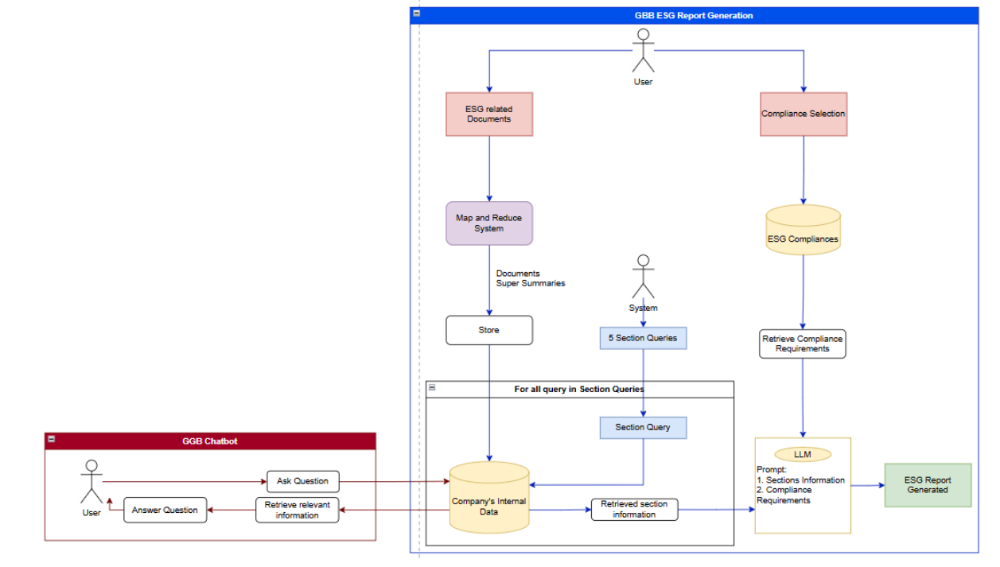
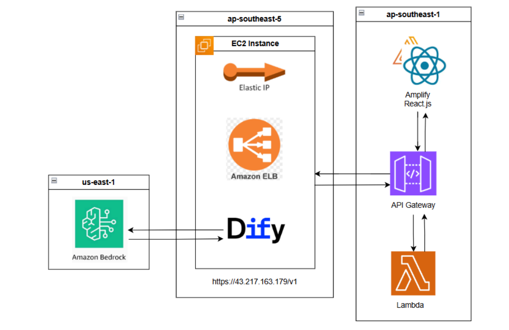

# GREEN GREEN BIRD (GGB): AI-Powered ESG Reporting Automation

*Leveraging AI for Automated ESG Reporting for Enterprises*

**GREEN GREEN BIRD (GGB)** is an AI-powered platform designed to automate Environmental, Social, and Governance (ESG) reporting for enterprises in Malaysia. The platform addresses the slow and costly manual process, which averages **6 months** and **RM400k per cycle**, by using a sophisticated AI engine built on AWS. By leveraging **Retrieval-Augmented Generation (RAG)** and **Large Language Models (LLM)**, GGB dramatically reduces reporting time by **80%** (to just 3 weeks), cuts costs by **70%**, and decreases errors by **90%**.

Demo: https://master.d1ee5mpvme6d26.amplifyapp.com/upload

---

## The Problem

ESG reporting requirements in Malaysia are rapidly expanding, moving from voluntary to mandatory for large-cap companies by 2025 as required by Bursa Malaysia. This presents significant challenges for businesses:

- **Time-Consuming:** Manual reporting takes an average of **6 months** for each cycle.  
- **Expensive:** The process costs companies an estimated **RM400k annually**.  
- **Inefficient:** Only **23%** of companies currently possess automatic data collection systems.  
- **High Risk:** Non-compliance can lead to severe consequences, including financial penalties, reputational damage, delisting threats, and limited market access.

---

## Our Solution

GGB provides a streamlined, automated solution that transforms the ESG reporting workflow. The platform is specifically tailored for the Malaysian regulatory landscape.

- **Automated Data Processing:** Users upload their existing ESG-related PDF documents directly to the platform. The system extracts and structures the relevant information using a MapReduce process.  
- **AI-Powered Generation:** Using a combination of RAG for data accuracy and an LLM for content creation, the system generates comprehensive reports.  
- **Compliance-Focused:** The platform aligns the generated reports with specific regulatory frameworks, such as the *MY Bursa Malaysia Sustainability Reporting Guide*.  
- **Actionable Insights:** Beyond report generation, GGB offers a real-time ESG performance dashboard and an AI chatbot for further analysis and personalized assistance.  

---

## Architecture & Core Components

- Frontend: React (Create React App), Ant Design, React Router
- Backend / infra: AWS Amplify, Amazon API Gateway, AWS Lambda (Node.js)
- AI orchestration / inference: Dify (primary) and optional Amazon Bedrock
- Additional infra used by deployments: Amazon EC2, Elastic IP, Amazon ELB, AWS Amplify, API Gateway, Lambda

Deployment pattern:
- Serverless frontend hosted via Amplify
- API Gateway + Lambda used for backend endpoints (report generation orchestration)
- Long-running or heavy workloads optionally handled on EC2 behind an ELB
- Dify orchestrates AI workflows; Bedrock can be used where enterprise AWS model hosting is required



Figure: High-Level Architecture — illustrates the end-to-end system: user uploads via the Amplify-hosted frontend, document processing and orchestration through API Gateway and Lambda, AI workflows managed by Dify (or Amazon Bedrock), and optional EC2 + ELB for heavy processing and model hosting.



Figure: AWS Deployment Architecture — shows the AWS resource layout and network boundaries, including Amplify hosting, API Gateway, Lambda functions, EC2 instances behind an ELB with Elastic IPs, and integrations to Dify/Bedrock for AI inference and workflow orchestration.


---
## Available Scripts

In the project directory, you can run:

- **`npm start`**  
  Runs the app in development mode. Open [http://localhost:3000](http://localhost:3000) to view it in your browser.

- **`npm test`**  
  Launches the test runner (see [App.test.js](src/App.test.js)) in interactive watch mode.

- **`npm run build`**  
  Builds the app for production to the `build` folder. It correctly bundles React in production mode and optimizes the build.

- **`npm run eject`**  
  Removes the single build dependency from your project. (Note: this is a one-way operation.)

---
## Installation

1. **Clone the Repository**  
   ```sh
   git clone <repository-url>
   cd esg-ai-reporting-automation
   ```

2. **Install Dependencies**  
   ```sh
   npm install
   ```

3. **Start the Development Server**  
   ```sh
   npm start
   ```

---
## Usage

1. **Upload ESG Documents**  
   Head over to the upload page ([UploadPDF](src/pages/UploadPDF.js)) to upload your PDF documents. Ensure that each file meets the requirements (max 10MB, .pdf format).

2. **Select ESG Framework**  
   During the upload process in [FileUploadSection](src/components/FileUploadSection.js), select the desired ESG framework to tailor the analysis.

3. **Generate Report**  
   After uploading and selecting the framework, click **"Generate Report"**. The progress is shown via the [AnalysisProgress](src/components/AnalysisProgress.js) component.

4. **View Dashboard & Insights**  
   Switch to the dashboard ([Dashboard](src/pages/Dashboard.js)) to review ESG metrics and insights in interactive charts and graphs. Detailed report insights are also available in [Insight](src/pages/Insight.js).

5. **Download Report**  
   Reports can be downloaded either as Markdown or PDF from the report page ([Report](src/pages/Report.js)).

---
## Contributing

Contributions are welcome! Please fork the repository and create a pull request for any new features, improvements, or bug fixes.
